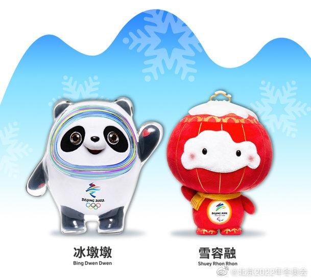

# 冰墩墩和雪容融能说话吗？北京冬奥组委规定：不能

北京冬奥会吉祥物“冰墩墩”成为新晋“顶流”，从各国运动员、记者到普通民众，无不被冰墩墩憨态可恭的样子征服，连冬奥村里都一度出现“一墩难求”的现象。作为奥运吉祥物，冰墩墩与其伙伴——北京冬残奥会吉祥物雪容融其实是不可以开口说话的！

根据国际奥组委的规则，吉祥物不能有性别的差异。而一旦说话就很容易分辨性别，因此，北京冬奥组委在与制片方签订协议时，就把“使用‘冰墩墩’‘雪容融’形象时不能说话且应当性别中立”的条款写了进去。

因此，冰墩墩和雪容融出现在公众场合时，都不会发出声音，仅以肢体动作传达信息。而在即将上映的动画电影《我们的冬奥》中，冰墩墩和雪容融也有亮相，但它们还是没有说话，仅发出咿咿呀呀的声音。

如果想要跟冰墩墩和雪容融有更深入的交流，人类就要动点脑筋了。最近，火遍全网的冰墩墩忠实粉丝、日本电视台主播辻冈义堂就对冰墩墩进行了一场独家专访：直播间里摆着“YES”和“NO”两个牌子，主持人提问后，冰墩墩选择“YES”和“NO”作出回答。

被问及“冰墩墩喜欢义墩墩（辻冈义堂为自己取的昵称）吗？”“知道东京上野动物园的双胞胎熊猫吗？”“喜欢吃炒饭吗？”冰墩墩都选了“YES”；至于“冰墩墩睡觉的时候会脱下宇宙服一样的外壳吗？”冰墩墩在“YES”和“NO”之间摇摆不定，辻冈义堂为冰墩墩解围：“这是秘密！”

奥运吉祥物是奥运会和残奥会大使，它们象征着奥林匹克精神，同时在迎接运动员和观众到来方面扮演者关键的角色。因此，使用吉祥物形象时尤其需要注意，切忌让奥运吉祥物“被动塌房”！
