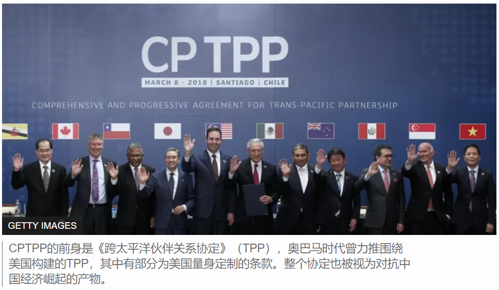
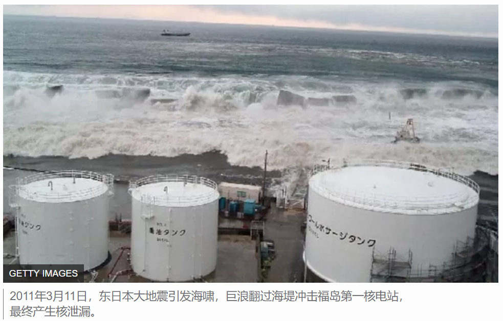

# 台湾解禁日本福岛食品进口 与冲刺CPTPP有何关系

[查看原文](https://www.bbc.com/zhongwen/simp/chinese-news-60314924)

台湾行政院周二（2月8日）召开记者会，宣布松绑日本福岛五县食品管制措施。台湾总统蔡英文称会回归科学检验，把关，不会让含有福岛核灾导致的“核食”进口台湾。

根据台湾官方说法，日本福岛、茨城、枥木、群马、千叶等5县“开放品项”的产品都需要检验方能进口台湾，不过该地带的野生鸟兽肉、菇类、 漉油菜则继续禁止入台。

台湾亟欲加入《跨太平洋伙伴全面进步协定》（CPTPP） ，并认为开放外国产品进口一直是加入国际贸易机制之关键，强调包含CPTPP全数会员国在内的全球40多国都已开放福岛食品进口。

“透过去年的公投，台湾向世界展现了，我们愿意接受国际标准，也有决心面对及解决困难贸易问题，走向世界贸易体系。”蔡英文昨日在社交媒体，向台湾民众喊话。

长期研究国际贸易仲裁的台湾中研院副研究员吴建辉曾向BBC中文分析称，为了推进与美国贸易谈判，在放宽美国“莱猪”进口限制上，蔡英文投注了极大的政治资本； 为了加入CPTPP，在福岛食物方面，蔡英文势必需要面对台湾内部的政治压力，没有多少回旋空间。

吴建辉认为在法律与科学上禁止福岛周遭五县食品入台都没有说服力，但如同“莱猪”在台湾引发的激烈讨论，他预计至少要两年后甚至是蔡英文离任后，台湾能正式进CPTPP。

但也有人批评称，叩关CPTPP与解禁福岛食品关系甚微，譬如台北市长柯文哲今日对台媒表示，这是给人民不切实际的期望。他说，国际经贸问题应分开处理，且也须考量自由贸易协定对台湾经济体系的相关冲击。

台在野党中国民党主席朱立伦则回应称该党大力“欢迎安全、可靠的日本食品，但只要是对民众健康有伤害的核灾食品，一定反对到底，食品安全、健康没有任何折扣空间。

## 台湾与CPTPP

台湾行政院发言人罗秉成在记者会上说，因为11年来，日本采取比国际标准更严格的管制措施，相关食品风险逐渐下降，各国因此陆续解除或放宽对日本福岛食品的相关管制，包括CPTPP在内的11个会员国的40几国，目前都已完全解除管制。以色列、美国在2021年也已加入完全解除管制行列，欧盟则大幅放宽对日本食品的管制，只对少数品项，要求附具辐射检验证明。

罗秉成又说，台湾经济是以外贸导向为主，不能自外于人。

根据台湾官方数据，CPTPP多数成员国都是台湾的重要贸易伙伴，合计占岛内国际贸易总额的24%以上。中国大陆和香港仍然是台湾的主要贸易伙伴，2020年，台湾对中国出口（含香港）达到1514.5 亿美元，占台湾总出口值43.8%。

有分析称，在CPTPP体系中占据重要位置的日本的态度，能够影响台湾申请加入的脚步。不过，日本这几年针对福岛食品与台湾申请加入CPTPP，一直都有发言，但意见并不一致。

譬如，2018年11月，由台在野党国民党提案的“反核食公投”通过，该公投主要内容为在两年内“维持禁止进口日本核灾地区食品”，同年12月，时任日本外务大臣河野太郎公开回应称：“因为台湾限制日本福岛食品，将无法参加CPTPP, 日本亦不排除在世贸组织内提出争端解决。”

2021年底，根据台媒联合新闻网，日本在台代表泉裕泰说，福岛食品和CPTPP没有连结，两者该分开讨论：“台湾人民的食品安全由台湾政府负责，日本的立场是食品安全应按照国际标准来判断，就是等待着台湾自己的决心。”

不过，今年1月中旬举行的第45届台日经济贸易会议上，台湾再次表示期待及早展开台湾申请CPTPP会员的建设性对话。当时，日本代表大桥光夫则称台日长期以来产业密切合作，特别是在半导体，台日已形成紧密的供应链伙伴关系，并期盼台湾能依据国际标准及科学处理福岛五县食品。

昨日台湾解禁福岛食品的消息宣布后，河野太郎在推特以英文发文，再次强调除非台湾解除针对福岛产品“不科学的禁令”，方能加入CPTPP。

日本国际教养大学（Akita International University）中国研究助理教授陈宥桦认为，日本让台湾参与CPTPP可能性高：“毕竟台湾已准备多年，渔业法、农药管理法、专利法都已针对该组织进行修改，与其他成员国完成了事先的阶段性协商。至于福岛食品的问题可能会留待台湾入会后，以双边协商来解决。”

在美国“莱猪”解禁，日本福岛五县食品及农产品大部分解禁之后，台湾叩关CPTPP的进度，将成为各界关注焦点，也考验蔡英文政府如何说服仍有疑虑的台湾民众。

## 福岛食品进口禁令由来

2011年3月11日，日本东北发生强烈地震，引发大海啸并波及区域核电厂，酿成福岛核灾。当年3月25日起，台湾宣布全面禁止进口福岛5县食品至今。十多年后，许多国家陆续解禁福岛食品。根据台湾行政院农委会主委陈吉仲，向台媒中央社说，截至2021年10月，全球只剩台湾跟中国仍对这些日本食品采取区域管制，台湾管制福岛等5县产地食品输入，中国大陆管制范围达福岛周边10县。

目前全球已有41国完全解除日本食品区域禁令，欧盟27国，而英国、冰岛、挪威、瑞士、俄罗斯等等则要求部分产品检附辐射检验合格证明。在亚洲，韩国、澳门及香港是禁止部分福岛产品输入。譬如韩国主要禁止含福岛等8县水产品及茶叶。

在台湾宣布对福岛周遭五县大部分食品解禁后，全球只剩中国仍全面禁止福岛周遭食品入口，而中国也在去年申请加入CPTPP申请。