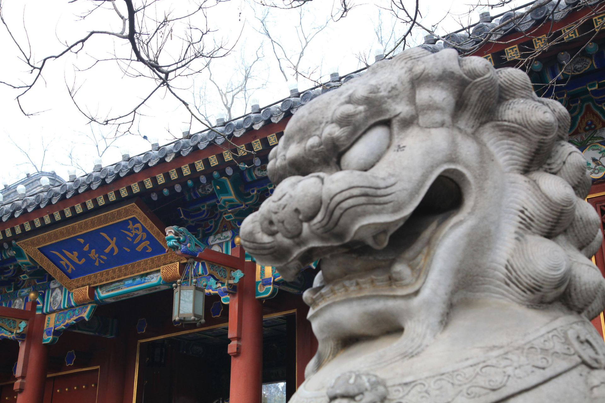

# 中国的“双一流”建设为何悄然改变措辞？

[查看原文](https://www.dwnews.com/%E4%B8%AD%E5%9B%BD/60277945/%E4%B8%AD%E5%9B%BD%E7%9A%84%E5%8F%8C%E4%B8%80%E6%B5%81%E5%BB%BA%E8%AE%BE%E4%B8%BA%E4%BD%95%E6%82%84%E7%84%B6%E6%94%B9%E5%8F%98%E6%8E%AA%E8%BE%9E)

2月8日，中国教育部在官方网站发布2022年工作要点，外界注意到，相较于往年的工作要点，关于“双一流”建设的说法此次有所变化。

教育部的2022年工作要点共分为6大类35个要点，其中第23点为“深入推进‘双一流’建设”。

该要点称，“扎根中国大地、瞄准世界一流，引导建设高校强化学科重点建设，加强马克思主义理论学科建设，实施一流学科培优行动和基础学科深化行动。按照基础研究、工程技术、人文社会科学人才培养的不同规律和需求标准，完善多元评价体系和常态化监测系统，逐步淡化一流大学建设高校和一流学科建设高校的身份色彩，选择具有鲜明特色和综合优势的建设高校赋予一定建设自主权，探索分类特色发展模式。开展教育部与各省（区、市）新一轮‘双一流’重点共建，加大统筹协调，支持各高校‘双一流’建设。”

值得关注的是，要点中提到“逐步淡化一流大学建设高校和一流学科建设高校的身份色彩”，这在中国教育部近年来的年度工作要点中为首次出现。

**有分析者说，这可能成为“双一流”建设未来发展过程的一个重要风向标。**

据官方介绍，“双一流”即为世界一流大学和世界一流学科，“是中共中央、国务院作出的重大战略决策，也是中国高等教育领域继‘211工程’‘985工程’之后的又一国家战略。”

在中国官方的愿景中，该高等教育战略将“有利于提升中国高等教育综合实力和国际竞争力，为实现‘两个一百年’奋斗目标和实现中华民族伟大复兴的中国梦提供有力支柱。”

“双一流”于2017年1月正式印发实施办法，同年9月，中国教育部等多部门联合发布“双一流”首批名单，其中世界一流大学建设高校42所，世界一流学科建设高校95所。

2019年11月，教育部公告已将“211工程”和“985工程”等重点建设项目统筹为“双一流”建设，表明“双一流”成为中国最高级别的高等教育发展战略。

**尽管已成为中国在教育领域的顶层设计之一，不过自施行5年以来，“双一流”遭遇到不少非议。**

如在“双一流”推出之初，即有质疑声音称这是高等教育行政主导下的“换汤不换药”，与此前的“211工程”和“985工程”并无显著不同，对中国高等教育的发展意义有限。

另外一些争议点则聚焦在“双一流”缺乏透明的评价体系。虽然“双一流”有相关的遴选认定程序，如“综合考虑有关第三方评价的权威性、影响力及高校认可度”、“统筹考虑国家战略、行业区域急需、不可替代性等因素”、“把牢政治关、坚持综合评价和内涵发展导向”等，但有评论指缺少具体的数据公示，令“双一流”评选变得更为“语焉不详”，更“行政化”、“意志化”了。

更被外界议论的是，因能否进入“双一流”名单关系到具体高校乃至相关省市的直接利益，在事实操作层面，不少高校忽略了“双一流”战略中真正重要的“建设”二字，而聚焦于挤进名单以“要资源”“要利益”。某种程度上，一些大学的建设心态因此产生扭曲，完全抛弃差异化、特色化发展，反而损害了高等教育的健康发展。

这可能也正是中国教育部此次强调“逐步淡化一流大学建设高校和一流学科建设高校的身份色彩”的重要原因之一。实际上，官方在拟定“双一流”建设机制过程中，早就注意到“高校数人头、拼硬件、铺摊子等恶性竞争、短期行为”，但在行政主导的激励机制下，此类“恶性竞争、短期行为”必会反复出现。

值得关注的一点是，“双一流”名单评选为5年一次，2017年的首批名单出炉至今正好度过5年时间。接下来，中国教育部是否仍将继续推出第二批名单，又将如何切实体现“逐步淡化一流大学建设高校和一流学科建设高校的身份色彩”，外界应持续予以关注。