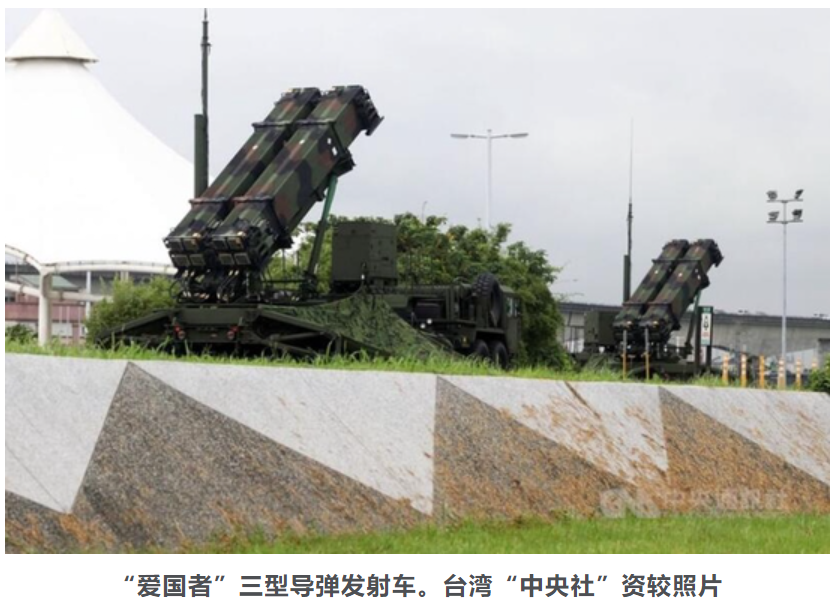

# 国防部：中方强烈要求美方立即撤销对台军售计划

[查看原文](https://news.sina.com.cn/c/2022-02-09/doc-ikyakumy4992383.shtml)

国防部新闻发言人吴谦就美对台军售答记者问。

问：据报道，美国防部国防安全合作局2月7日宣布，美方已批准向台湾出售价值约1亿美元的“爱国者”导弹防御系统设备和服务。请问对此有何评论？

答：美国向中国台湾地区出售武器，严重违反一个中国原则和中美三个联合公报特别是“八·一七”公报规定，粗暴干涉中国内政，损害中国主权和安全利益，破坏中美两国两军关系，危害台海地区和平稳定，中方对此表示强烈不满和坚决反对，向美方提出严正交涉。

世界上只有一个中国，台湾是中国领土不可分割的一部分。中方强烈要求美方立即撤销上述对台军售计划，停止美台军事联系，停止向“台独”分裂势力发出错误信号，以免给中美两国两军关系和台海和平稳定造成严重后果。

台湾前途在于国家统一，台湾安全靠的是一个中国原则下两岸同胞的共同努力，而绝不是美国售台武器。中国人民解放军将采取一切必要措施，坚定捍卫国家主权和领土完整，坚决挫败任何形式的外部势力干涉和“台独”分裂图谋，持续推进祖国统一进程。

**相关新闻：**

**再次粗暴干涉中国内政！拜登政府第二次对台军售，总价约1亿美元**

[环球网综合报道 记者赵友平]台湾“中央社”消息称，美国国务院当地时间7日宣布，批准对台出售价值1亿美元、为期5年的“爱国者”系统工程勤务计划。报道声称，“此次军售有助台湾维持导弹密度、确保空中作战战备能力，以吓阻区域威胁”云云。就美国此前对台军售，中国国防部曾表示，美方这一行径罔顾国际法和国际关系基本准则，严重违反一个中国原则和中美三个联合公报规定，粗暴干涉中国内政，损害中国主权和安全利益，向“台独”分裂势力发出错误信号，危害台海地区安全稳定。

报道称，美国国务院政军局通过新闻稿宣称，已决定出售支持台湾参与“爱国者导弹”工程勤务及导弹效能鉴测计划的设备与服务，为期5年，总价约1亿美元，其中包含工程服务支持，以维持、改善“爱国者”防空导弹系统。

报道还称，美国国防部国防安全合作局已经将这项军售正式知会国会，这是美国总统拜登去年1月底上任以来第2次对台军售。

台防务部门8日上午通过新闻稿声称，美国基于“与台湾关系法”与对台“六项保证”，“持续协助台湾维持足够的自我防卫能力，是维持区域稳定的基础”，台防务部门“感谢美方军售决定”。台防务部门还称，这项对台军售案可望在3月正式生效。

美国不断粗暴干涉中国内政。

去年8月4日，美国国防部国防合作安全局发布消息称，美国务院已批准向台出售总价7.5亿美元的40套中型自行榴弹炮系统及相关设备。对此，中国外交部发言人曾表示，台湾是中国领土不可分割的一部分。美国向台湾出售武器，干涉中国内政，损害中国主权和安全利益，违背国际法和国际关系基本准则，更违反一个中国原则和中美三个联合公报特别是“八·一七”公报规定，向“台独”分裂势力发出错误信号，严重损害中美关系和台海和平稳定。中方对此坚决反对，已向美方提出严正交涉。

中方敦促美方重信守诺，切实恪守一个中国原则和中美三个联合公报规定，停止售台武器和美台军事联系，立即撤销有关对台军售计划，以免进一步损害中美关系和台海和平稳定。中方将根据形势发展坚决采取正当、必要反制措施。

中国国防部也随后对此表示，美方这一行径罔顾国际法和国际关系基本准则，严重违反一个中国原则和中美三个联合公报规定，粗暴干涉中国内政，损害中国主权和安全利益，向“台独”分裂势力发出错误信号，危害台海地区安全稳定。中方对此表示强烈不满和坚决反对。

国防部还表示，中国人民解放军有决心、意志和能力，坚决挫败任何形式的外部势力干涉和“台独”分裂图谋，将采取一切必要措施，坚定捍卫国家主权和领土完整。 