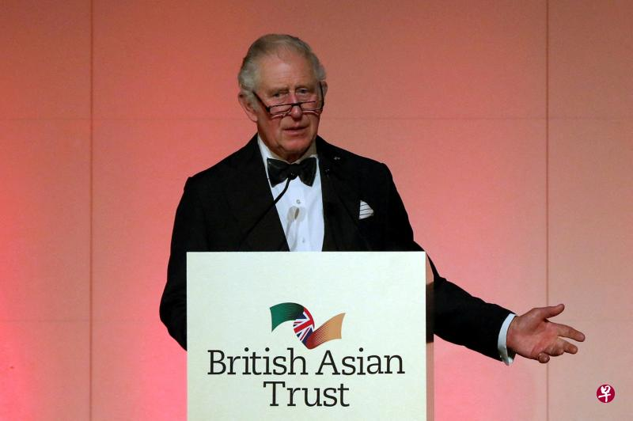

# 英国查尔斯王子二度感染冠病

[查看原文](https://www.zaobao.com/realtime/world/story20220210-1241413)

英国查尔斯王子二度感染冠病。

路透社报道，克拉伦斯宫周四（2月10日）表示，73岁的查尔斯王子周四早上冠病检测结果呈阳性，目前正在自我隔离，并已取消当天的活动行程。

查尔斯王子已在去年12月接种冠病疫苗追加剂，他在2020年3月首次染疫，当时症状轻微。

查尔斯王子周三（9日）曾出席一场英国亚洲信托基金的招待会，照片显示他在活动上与英国财长苏纳克和其他嘉宾交谈。英国卫生部长贾维德和内政部长帕特尔也是出席者之一。