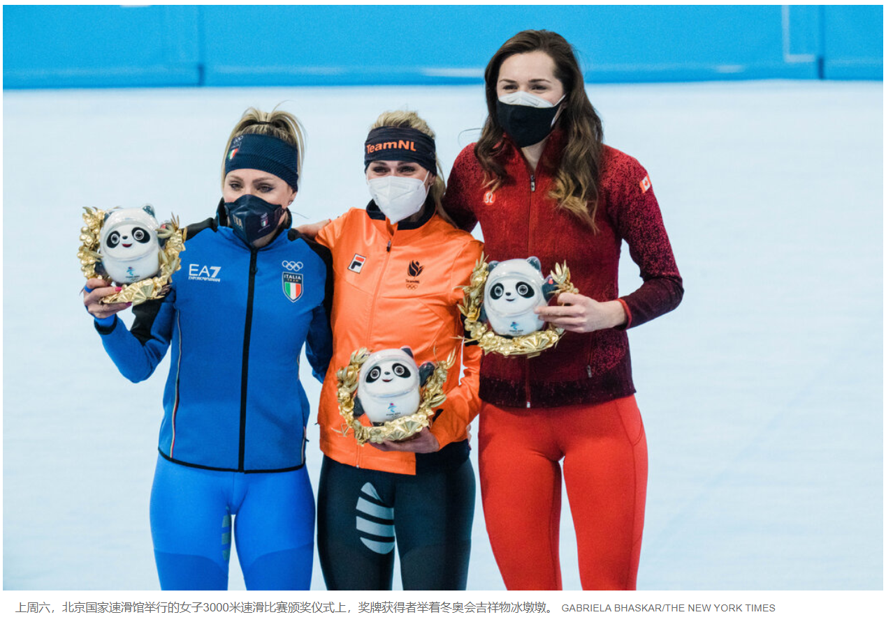
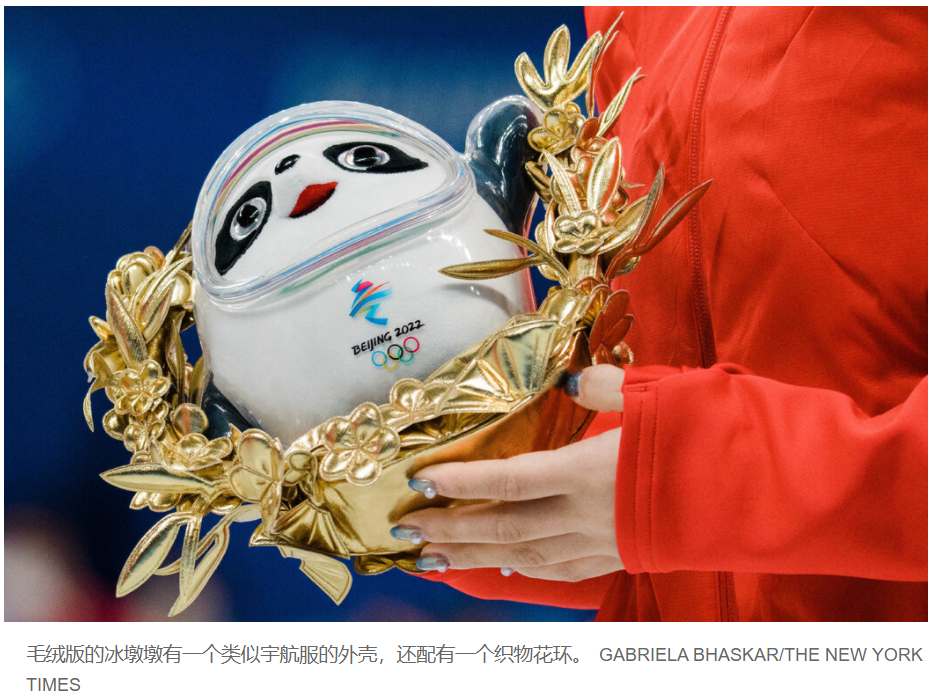

# 冬奥会现场颁奖为何只颁发冰墩墩？

[查看原文](https://cn.nytimes.com/sports/20220211/stuffed-animals-medals-olympics/)

在人生中最辉煌的时刻过后不久，获胜的奥林匹克运动员们手持的不是他们多年（如果不是几十年）梦寐以求的奖牌，而是有一层塑料外壳的毛绒玩具。

每个项目的决赛结束后都会马上举行一个颁奖仪式，但运动员们要在第二天举行的第二个颁奖仪式上才能拿到奖牌。在第一个颁奖仪式上，运动员们走上人们熟悉的冠亚季军领奖台。如果是在夏季奥运会上，颁奖者会把奖牌挂到获胜运动员的脖子上。

但在北京冬季奥运会上，奖牌获得者得到的却是某种替代物品：本届奥运会吉祥物熊猫“冰墩墩”的毛绒玩具版，它穿着类似宇航服的冰外套，周身环绕着一个金色织物花环，上面缝制着松竹梅的图案。不管运动员赢得的是金牌、银牌，还是铜牌，他们得到的都是同样的纪念品，与商店里卖给粉丝们的没有多大不同。

“我们迄今已在这届奥运会上收集到不少的东西，所以我有一个把这些东西带回国给家人的藏宝袋，”女子3000米速滑铜牌得主伊莎贝尔·魏德曼在谈到奖牌替代物时说。

她表示，在比赛结束一天后的周日拿到真正奖牌时的感觉，与手拿熊猫毛绒玩具的感觉“非常不同”。

“拿奖牌的感觉也更激动，”她说。

第二个颁奖仪式在一个专门用于颁发奖牌的场地举行，奖牌获得者被安排从舞台上列队通过，数百名观众在奥运圣火旁为他们欢呼。运动员们再次登上冠亚季军领奖台，然后，国际奥委会的官员把奖牌发给他们，由他们自己戴上。他们被允许摘下口罩片刻。

2018年平昌冬奥会也用了类似形式的两次颁奖仪式。

赢得银牌的意大利短道速滑男女混合队队员阿里安娜·方塔纳在周日的奖牌颁发仪式结束后说，有更多的人观看她被授予奖牌是好事，她参加比赛的短道速滑体育馆里基本上没有观众。

“现在是真的了，”她说。“昨天有许多的热血沸腾，许多的感情，也许需要点时间才能搞清楚到底发生了什么。”

她接下来说：“今天我们的脖子上挂上了奖牌，感觉棒极了。”