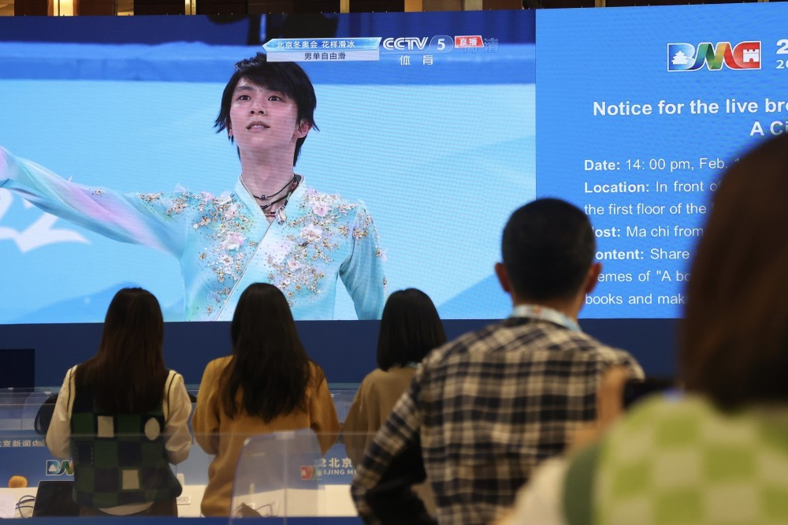

# 羽生结弦，生机勃勃地活着

[查看原文](https://new.qq.com/omn/20220211/20220211A014OO00.html)

第三次冬奥之旅，也可能是自己的最后一届奥运会上，羽生结弦距离完美完成4A（阿克塞尔四周跳）只差一点。

跌倒，随即优雅地起身，再次跌倒，然后再次优雅起身……在空灵的《天与地》乐曲伴奏下，羽生结弦仿佛在用他的自由滑，讲述着他与花样滑冰的故事。

羽生结弦曾用“一生悬命”来描述自己对于花滑的态度。在日语里，“一生悬命”就是“拼尽一生”的意思。**过去4年甚至更长的时间里，他确实在用这样的态度挑战着4A这个“终极目标”，即便一次次重重地摔在地上，即便膝盖长期肿胀淤青，他依旧不停尝试。**

羽生，和这片冰场融为了一体。

事实上，27岁的羽生结弦可以有很多方式接近这枚金牌，但羽生却选择了最困难的一条路。

**“有了4A，我才能如此生机勃勃地活着。”**羽生结弦曾这样解释他为何执拗地挑战着4A，他希望展现极致的美，而这可能也是他站上北京冬奥会花样滑冰赛场的动力。

就如他在赛后所说，**“有一那么一瞬间大家觉得‘羽生结弦的节目真好看啊’，那我的努力就有意义了。”**

4A，是羽生一生的羁绊。

**摔倒**

就在北京冬奥会男单自由滑比赛开始前的集体热身中，羽生结弦在结束热身前的最后一次试跳中，还是摔倒了。

显然，他并没有在自己的最好状态。

滑回场边备赛的过程中，羽生结弦嘴里嘟囔着什么，像是在回忆动作，但又像是在给自己打气。事实上，这已经成了羽生结弦在挑战4A的这几年里，一种常见的自我激励方式。

一位日本电视台的记者曾经透露，他每次看到羽生训练时，羽生都会嘟嘟囔囔，“‘这次不是正式的’‘相信自己’……”

当羽生结弦再次出现在首都体育馆的冰面上，他就要正式开始自己的自由滑表演。所有人都知道，羽生想要挑战4A。于是，在他走上冰面的那一刻，全场沸腾。

**而就在欢呼声逐渐平息时，一个三四岁孩子稚气的声音突然从观众席上蹿了出来，“羽生结弦加油”。随即跟着一阵大人们的笑声。**

在整场男单自由滑的比赛里，能够享受到这位孩子纯真的“加油祝福”的选手只有金博洋和羽生结弦。

音乐响起，羽生结弦开始在冰面上自由地舞蹈。第一个跳跃动作，羽生结弦就全力起跳，腾空，旋转，一切都如此轻盈而流畅，遗憾的是在落地的时候，他还是失去了重心，滑倒在地面上。

但他随即就借着一个翻身，优雅地站起来，继续投入表演。但在紧接着的下一个四周跳中，羽生结弦又摔倒了……

两次失误，基本也就意味着羽生结弦无缘“奥运三金”，但他依旧优雅地完成了接下来的表演。**当音乐落下，羽生在全场的掌声中完成谢幕，然后朝着四面的观众都深深鞠躬，每一次鞠躬，他都弯腰超过90度，然后保持两三秒。**

羽生赛后也动情了。

在回到场边等待分数的过程中，他也一如比赛中一样优雅地滑着舞步，仿佛只要站在冰面上，他的表演就没有结束。

**直到离开冰面的那一刻，羽生弯腰用双手接触冰面，然后抬起触摸冰面的双手深情一吻。这一幕被现场很多摄影师记录了下来。**

那一刻，羽生结弦的双眼湿润了。

赛后的混采区里三层外三层围满媒体记者。

**牺牲**

“不知道我这次的表现是否能够满足大家的期待，但大家的支持我全部都感受到了，说实话也因此真的觉得很抱歉。”

在赛后的混合采访区里，近百名日本和中国的记者将通道的一角挤满，中间还掺杂了几名外国记者。在等待了接近1个半小时之后，羽生结弦终于在工作人员的陪同下出现，然后说出了自己的真实感想。

**“在短节目中发生了那样的意外，确实是非常遗憾和不甘心。一直以来，我已经尽我全力把我能想到的，还有应该做的都做了。”**

羽生结弦自己说，“我真的拼尽全力努力了。这可能是没有回报的努力，但这次我全力以赴去拼了。”

**而在进入混合采访区之前，羽生见到了日本花滑名宿荒川静香，“真的不甘心，为什么努力得不到回报，我真的很努力了。”霎时，眼泪再次涌出……**

确实，如果只是为了冲击“奥运三金”的目标，羽生结弦大可选择其他的自由滑编排去挑战状态更好的美国名将陈巍。

羽生本场比赛也是带伤出战。

要知道，4A这个历史级别的高难动作，其实并不是一个“划算”的选择——在国际滑联制定的赋分规则中，4A仅比排名第二的4Lz（勾手四周跳）多1分，但两个动作的难度不可同日而语。

这也是为什么北京冬奥会冠军陈巍曾经表示，4A不管在训练还是比赛中都风险太大，所以暂时没有想过要挑战4A。

就是在这样的情况下，原本身体状态和竞技状态都没有达到最佳的羽生结弦，还是选择了挑战4A。

“当然，不犯任何错误是很重要的，只有不犯错误，才能在这里赢下其他对手，但我觉得《天与地》的故事就是因为我在前半程所犯的错误，才能诠释出来。”

谈到再一次挑战4A失败时，羽生结弦说到了他最初选择这首《天与地》的初衷，这是一部日本著名大河剧的主题曲，而剧中的主角则是日本武将上杉谦信。

“上杉谦信非常了解战斗的乐趣，但与此同时他的内心也有纠葛，在面对与自己的战斗时，总是能体会到与之伴随的牺牲。”

**这也正是羽生结弦如今的心态——明知道以现在的状态挑战4A，是一项不可能完成的任务，但他依旧义无反顾，全力以赴，并且充满斗志。**

时刻关注羽生的记者们。

**优雅**

奥运是残酷的竞技舞台，在顶尖选手的对决中，失误就意味着失败。但这并不妨碍走下赛场的羽生结弦以一种“胜利者的姿态”接受外界的赞赏。

在羽生结弦的自由滑比赛结束后，不少人的朋友圈就被各种关于羽生的新闻和报道“刷屏”，文字里讲述着羽生结弦在过去27年的各种遭遇以及他面对各种困难时的执着和坚定。

而在赛场外的混合采访区里，不少记者一边关注着谁是最后的冠军，一边讨论着羽生在比赛中挑战失败的4A是否最终得到了国际滑联的认定。

甚至连羽生结弦在赛场上的对手都对他表达了敬佩和赞叹。

**就如金博洋所说，“我觉得他的精神是不可思议的，如果是我，参加第二届奥运会后肯定会退役，但他还继续参加了第三届。在27岁的时候还在突破四周半可能会更难。这两点如果能够达到一点，我觉得这种精神都值得人们学习。”**

当然，也有一种舆论的声音认为，外界对于羽生结弦的褒奖和赞叹有些“过头”了，但必须承认的是，从他与花样滑冰结缘至今的这23年时间里，羽生结弦是这片冰场上一份珍贵的财富。

**这不仅仅是因为他对于极限的执着追求，更是因为他在赛场上下所展现出的人格魅力——那种尊重他人，还有面对胜负时的低调谦和。**

2014年的花滑大奖赛中国站上，血染赛场的羽生结弦下巴缝了7针，并且在简单包扎后重回赛场赢得第二名；2017年赫尔辛基世锦赛上，他主动帮中国选手金博洋，把拿反的中国国旗摆正；2018年的平昌冬奥会上，为了不打扰队友采访，羽生结弦偷偷从队友身后双膝跪地式爬走……

类似这些展现出羽生结弦人格魅力的故事太多了，而每一段故事都解释了为什么羽生结弦能够吸引到如此多粉丝，甚至能将北京冬奥会的赛场变成他个人的“主场”。

就在羽生结弦完成自由滑比赛的两个多小时后，首都体育馆外依旧有一群羽生结弦的粉丝拿着他最喜欢的毛绒玩具在等候着他的出现。

由于疫情防控的考虑，羽生结弦无法和这些粉丝们见面，但他在混合采访区里一遍一遍感谢着每个人的支持。

**“我不知道自己的表现是否回应了冰迷们的期待，但我是带着‘感谢大家’的心情去滑的。只要能够稍微把这份谢意回馈给观众，在接下来的表演中，我都会全力去做。”**